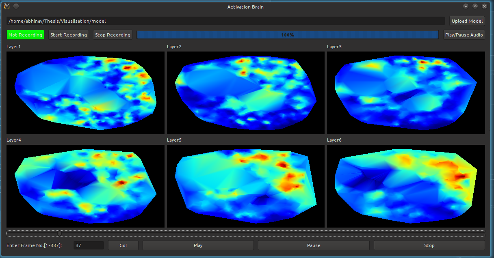

# DNN-Activation-Brain

This is a toolkit to visualize the hidden layers of a Deep Neural Network. Currently it takes a Kaldi model as input and takes in MFCC features with LDA as input to the DNN model. Here's a snapshot of the application.



## Libraries required (for Linux):
Run the following commands on Debian/Ubuntu systems (Package name same in other distros):
```
sudo apt-get install python python-numpy python-scipy python-matplotlib python-pip python-opengl python-qt4*
python pip -m install pyaudio
```

For installing Kaldi, run the following commands:
```
git clone https://github.com/backpropper/kaldi.git kaldi
cd kaldi/tools/; make; cd ../src; ./configure; make
```

## Files:
- `deepbrain.py`: Main python application file
- `getact.sh`: bash file to get activations from the Kaldi model. Creates the activations file. Need to change the Kaldi installation path at the top of the file.
- `activities` & `activities.realtime`: sample activations of previously recorded wav files (can be used instead of recording live audio or if Kaldi is not installed)
- `layers`: text file containing the number of layers to display in the application
- `lda`: folder containing `vertices` and `indices` file for each of the layers
- `vertices`: a 2048 x 2 matrix (each row is a 2D coordinate for each hidden unit computed using t-SNE plots)
- `indices`: a 4069 x 3 matrix (each row is a tuple containing indices to the vertices that form a triangle computed after Delaunay Triangulation)
- other files in the model folder are DNN model files used for feature transformation and storing the Deep Neural Network parameters.

## How to run:
- Run `python deepbrain.py`.
- After the window opens, select `Upload Model` and choose the directory where the folder `lda` which contains `vertices` and `indices` of all the layers is present along with the other DNN model files (here it is the "model" directory).
- Then select `Start Recording` to start recording the live audio sample (or upload a pre-recorded wav file). Select `Stop Recording` to stop the recording and then the GUI will appear. This step might take some time to render the graphics depending upon the model size and the length of the recorded audio.
- You can also record another audio sample by clicking the `Start Recording` button again. This will refresh the GUI to display the activations of the newly recorded audio sample.

## TODO:
- Add support for other more complex DNN models (with ivcetors).
- Integrating other types of features such as fMLLR.

## Author:
Abhinav Gupta
